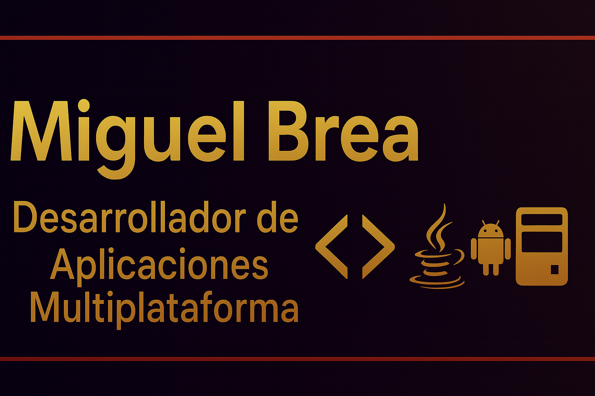

<!-- Banner -->

  

# 👋 ¡Hola! Soy **Miguel Brea**

🎓 **Estudiante de 2º DAM (Desarrollo de Aplicaciones Multiplataforma)**  
💻 Enfocado en el desarrollo backend, Android con Jetpack Compose, bases de datos y entornos empresariales como **Odoo** y **SAP ABAP Cloud**.

---

## 🚀 Sobre mí

Soy una persona curiosa, metódica y con muchas ganas de seguir creciendo como desarrollador.  
Me apasiona crear proyectos claros, ordenados y bien estructurados, y actualmente estoy especializándome en:

- Desarrollo Android con **Kotlin** y **Jetpack Compose**
- Programación en **Java** (POO, testing, documentación)
- Bases de datos SQL y NoSQL
- Desarrollo web (HTML, CSS/Sass, JavaScript básico)
- Integración con SAP y programación **ABAP Cloud**
- Modelado, UML, depuración, control de versiones y práctica profesional

---

## 🧠 **Tecnologías y herramientas**

### 📌 Lenguajes
- **Java**, Kotlin (Android)
- Python (básico)
- ABAP Cloud (iniciación)
- JavaScript básico
- SQL
- XML / JSON

### 📌 Bases de datos
- MySQL (phpMyAdmin, HeidiSQL, Workbench)
- Oracle SQL Developer
- MongoDB básico

### 📌 Desarrollo Web
- HTML5 • CSS3/Sass • Bootstrap  
- Flexbox / Grid  
- AJAX (básico)  
- Figma para diseño

### 📌 Entornos & DevOps
- Git / GitHub  
- Linux (Ubuntu)  
- VirtualBox  
- Docker básico

### 📌 Herramientas
- Android Studio  
- Eclipse  
- NetBeans  
- VSCode  
- Dia (UML)

---

## 📚 **Proyectos destacados**

### 📱 Tutorial Android — Jetpack Compose  
Actualmente estoy creando un tutorial paso a paso para ayudar a estudiantes a aprender Compose desde cero, incluyendo contenedores (Box, Row, Column), layouts y arquitectura.

### 🧩 Intérprete desde cero  
Guía educativa donde explico cómo construir un intérprete simple paso a paso para comprender análisis léxico, sintáctico y semántico.

### 🏢 Integración con SAP ABAP Cloud  
Tutorial básico de cómo conectar Eclipse con SAP ABAP Cloud y crear las primeras clases, servicios y objetos.

---

## 📫 **Contacto**

📧 Email: **[dambrea01@gmail.com]**  

---

### ✨ *“Construyendo software claro, útil y escalable.”*

