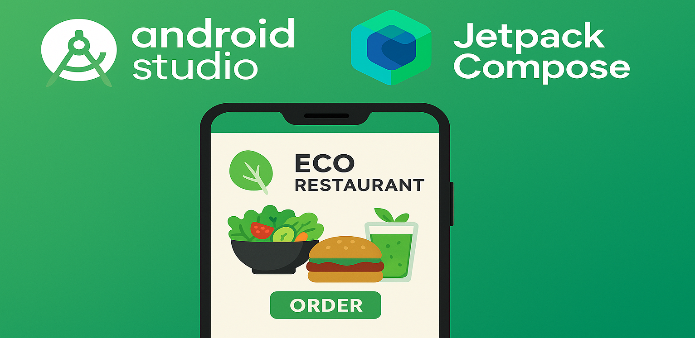
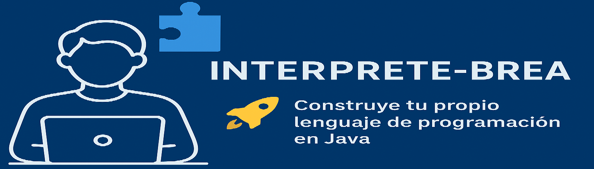
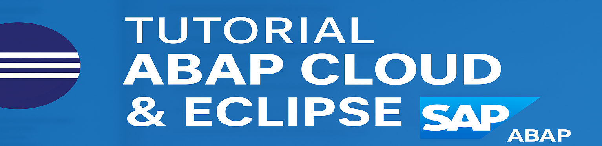

<!-- Banner -->

  

<h1 align="center">👋 ¡Hola! Soy <strong>Miguel Brea</strong></h1>

  🎓 Estudiante de 2º DAM (Desarrollo de Aplicaciones Multiplataforma)  
  💻 Enfocado en backend, Android con Jetpack Compose, bases de datos y entornos empresariales como <strong>Odoo</strong> y <strong>SAP ABAP Cloud</strong>

<h2>📫 Contacto</h2>

  📧 Email: <a href="mailto:dambrea01@gmail.com"><strong>dambrea01@gmail.com</strong></a>

  ¡Estoy abierto a nuevas oportunidades! Contáctame para desarrollar aplicaciones, colaborar en proyectos, formar parte de un equipo, o cualquier propuesta interesante. Me entusiasma crecer profesionalmente y crear soluciones juntos.

<h2>🚀 Sobre mí</h2>

Soy una persona curiosa, metódica y con muchas ganas de seguir creciendo como desarrollador. Me apasiona crear proyectos claros, ordenados y bien estructurados. Actualmente me estoy especializando en:

<ul>
  <li>Desarrollo Android con <strong>Kotlin</strong> y <strong>Jetpack Compose</strong></li>
  <li>Programación en <strong>Java</strong> (POO, testing, documentación)</li>
  <li>Bases de datos SQL y NoSQL</li>
  <li>Desarrollo web (HTML, CSS/Sass, JavaScript básico)</li>
  <li>Integración con SAP y programación <strong>ABAP Cloud</strong></li>
  <li>Modelado UML, depuración, control de versiones y buenas prácticas profesionales</li>
</ul>

<h2>📚 Proyectos destacados en desarrollo</h2>

<table>
  <tr>
    <td align="center">
      
    </td>
    <td align="center">
      
    </td>
    <td align="center">
      
    </td>
  </tr>
  <tr>
    <td align="center"><strong>EcoEat</strong></td>
    <td align="center"><strong>Intérprete desde cero</strong></td>
    <td align="center"><strong>SAP ABAP Cloud</strong></td>
  </tr>
</table>

  <h3>📱 <a href="https://github.com/dambrea01-lgtm/EcoEat-JetpackCompose">Tutorial Android — Jetpack Compose</a></h3>
  
Creación de un tutorial paso a paso para ayudar a estudiantes a aprender Compose desde cero, incluyendo contenedores (Box, Row, Column), layouts y arquitectura.

  <h3>🧩 <a href="https://github.com/dambrea01-lgtm/brea-interpreter">Intérprete desde cero</a></h3>
  
Guía educativa donde explico cómo construir un intérprete simple paso a paso para comprender análisis léxico, sintáctico y semántico.

  <h3>🏢 <a href="https://github.com/dambrea01-lgtm/abap-eclipse">Integración con SAP ABAP Cloud con Eclipse</a></h3>
  
Tutorial básico de cómo conectar Eclipse con SAP ABAP Cloud y crear las primeras clases, servicios y objetos.

<h2>💡 Intereses y futuros proyectos</h2>

  Estoy explorando el mundo de <strong>criptomonedas y criptografía</strong>, investigando cómo iniciar un proyecto interesante y real en este sector. Actualmente me encuentro en la fase de <strong>recolección de información y análisis del mercado</strong>, con el objetivo de crear soluciones útiles en el futuro.

  Además, estoy considerando mis próximos pasos académicos y profesionales: una vez finalice mi curso de Desarrollo de Aplicaciones Multiplataformas, estoy evaluando realizar un <strong>curso de especialización en ciberseguridad</strong> o un <strong>máster en Inteligencia Artificial y Big Data</strong>. Aún no he tomado una decisión, ya que dependerá de diversos factores y oportunidades.

<h2>📫 Contacto</h2>

  📧 Email: <a href="mailto:dambrea01@gmail.com"><strong>dambrea01@gmail.com</strong></a>

  No dudes en escribirme si quieres colaborar, proponer proyectos o simplemente intercambiar ideas sobre desarrollo de aplicaciones, ciberseguridad, IA, blockchain o cualquier tema tecnológico.

<h2 align="center">✨ <em>“Construyendo software claro, útil y escalable.”</em></h2>

